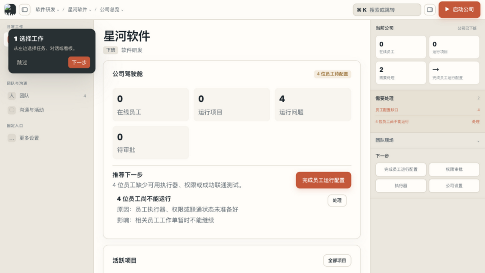
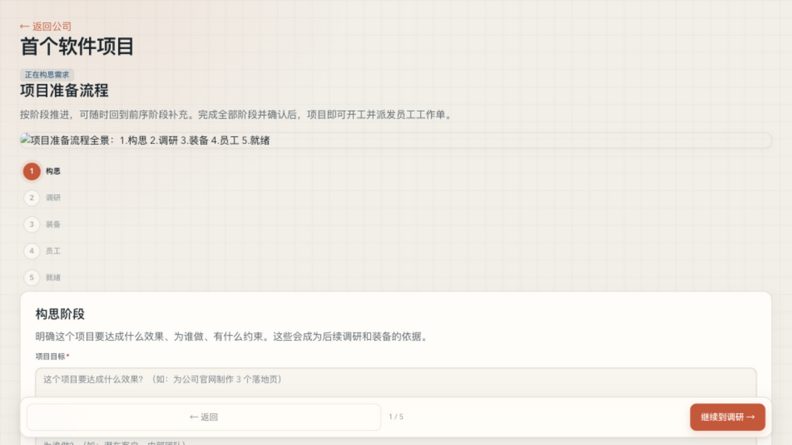
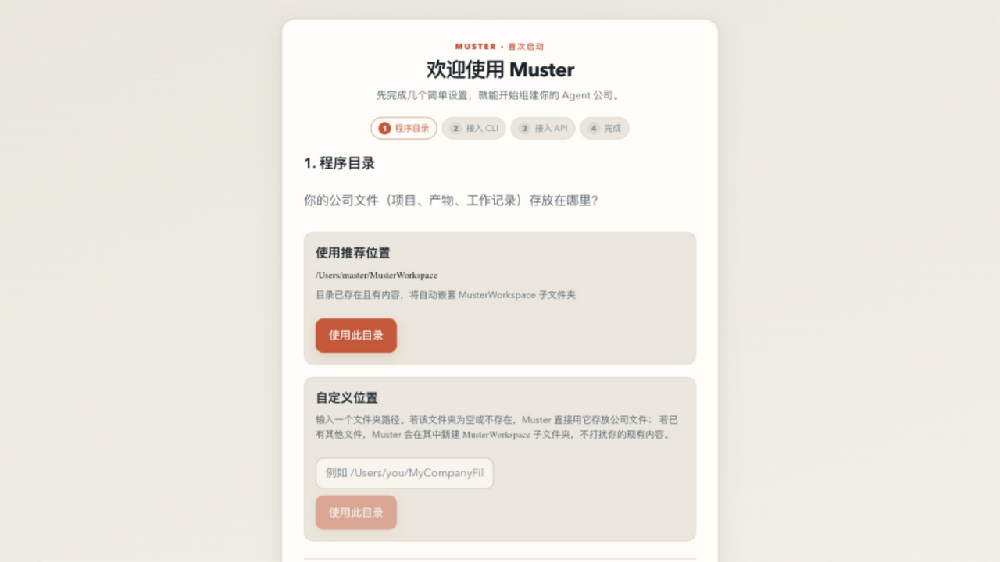
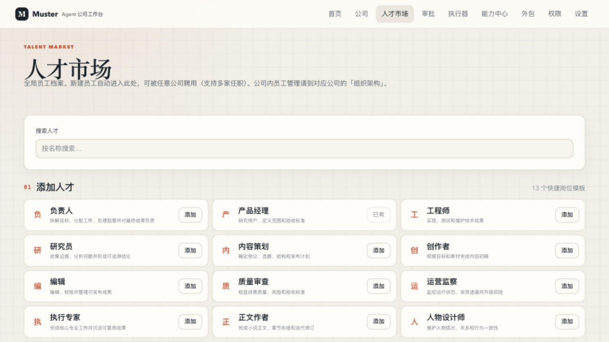
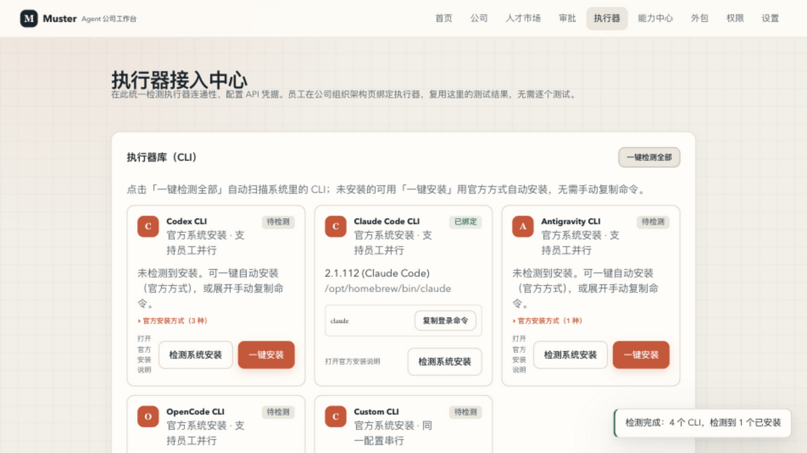
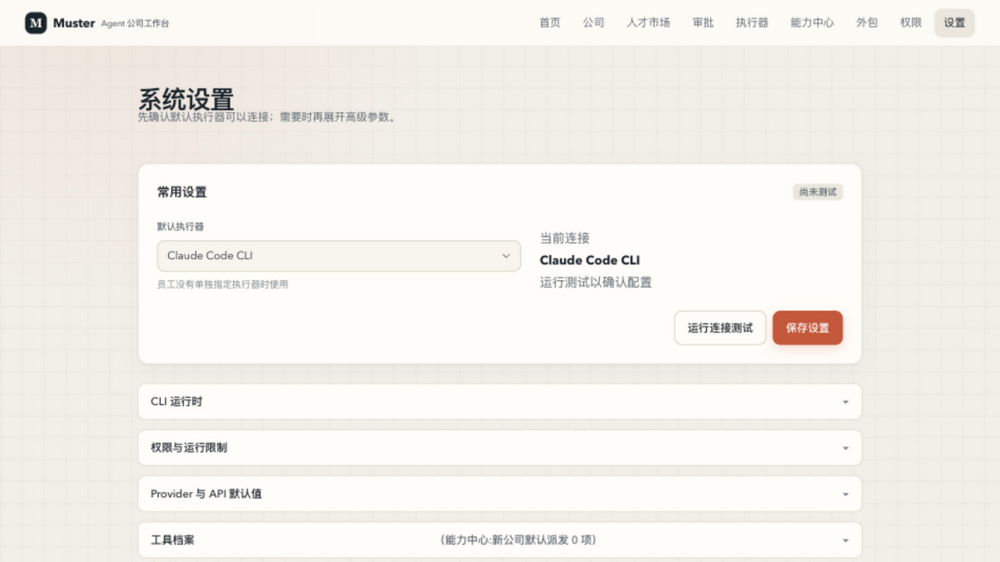

# Muster · 本地 Multi-Agent 公司工作台

<p align="center">
  <strong>面向个人与团队的私有化、全闭环 Agent 虚拟公司工作台</strong>
</p>

<p align="center">
  <a href="LICENSE"></a>
  <a href="PRIVACY.md"></a>
  <a href="TERMS.md"></a>
  <a href="https://github.com/your-org/muster/actions"></a>
  <a href="CONTRIBUTING.md"></a>
</p>

---

## 📸 界面预览

> 截图基于演示数据生成，页面样式持续优化中，最终版本以发布为准。

| 首页（公司运行现场） | 公司详情（组织架构） |
| :---: | :---: |
|  |  |

| 项目工作台 | 首次启动引导 |
| :---: | :---: |
|  |  |

| 人才市场 | 执行器中心 | 系统设置与备份 |
| :---: | :---: | :---: |
|  |  |  |

---

## 💡 什么是 Muster？

**Muster** 是一个运行在本地机器上的 **Multi-Agent 工作台**。

> 方向（蓝图组织）：工作台里有智能体，智能体按任务换人设，组织形状存在蓝图里，蓝图靠自动复盘越来越准，做完的东西进归档。组织 = f(活)——不再要求你先设计组织，从"我有件事要办"直接开工。

与简单的单次问答或群聊机器人不同，Muster 采用**“持续营运的公司架构”**：

- **分类模板建司**：一键创办【软件研发】、【内容创作】、【长篇小说】、【品牌营销】、【行业咨询】或【通用项目】公司。
- **固定岗位与专业员工**：200+ 嵌入式 AI 专家人设档案，分部门协作，拥有独立 Agent Home、个人空间与分层记忆。
- **项目与 Task 隔离沙盒**：每个任务独占隐藏 Git Worktree 沙盒，分支隔离开发，自动进行并发控制与三方代码落盘合并。
- **执行器多端兼容**：无缝支持 Claude Code CLI、Codex CLI、Antigravity CLI、OpenAI 兼容 API 及 Gemini API。

---

## ✨ 核心功能

### 🏢 公司经营
- **6 种公司模板**：软件研发 / 通用项目 / 内容创作 / 长篇小说 / 品牌营销 / 行业咨询，一键生成完整组织架构（部门 + 岗位 + 流程）。
- **组织架构管理**：部门、员工、负责人、监察岗位；上下班状态机（off → online → draining → review_paused）。
- **员工档案**：200+ 专家人设，独立 Agent Home、个人空间与分层记忆；支持招聘、转正、临时工、离职交接。

### 🤝 多 Agent 协作
- **项目工作台**：以项目为中心，员工围绕 Task 协作；Task 有需求确认门（launch gate）与验收门。
- **任务隔离沙盒**：每个 Task 在独立 git worktree 中运行，自动并发控制与产物合并。
- **业务审批**：素材/成品/人物/剧情等产物提交审批流，支持批准/打回/返工。
- **交接与外包**：任务交接（offboard）；B2B 外包决策树与外包中心已退役（蓝图组织批次5）——能力缺口统一走临时工选拔（复用候选 → 人才库 → 新建），契约状态机与跨公司交付管线保留，待改造为跨项目交付协议。

### ⚙️ 执行器平台
- **一键检测**：自动扫描系统已安装的 Claude Code / Codex / Antigravity / OpenCode CLI。
- **一键安装**：平台智能选择官方安装方式（brew / curl / npm），SSE 流式日志，失败自动 AI 诊断。
- **API 凭据执行器**：OpenAI 兼容 / Gemini API，密钥只存环境变量引用，明文不入库。
- **连通探针**：绑定后自动测试版本、认证与模型可用性，员工复用同一结果。

### 💾 数据与迁移
- **启动引导**：首次运行 4 步向导（程序目录 / CLI 检测 / API 接入 / 完成），目录空则直接用、非空自动嵌套。
- **工作区迁移**：整个工作区目录（含项目文件）可整体搬移，路径自动重映射；前置校验要求全部公司下班。
- **备份导出/导入**：结构化配置（公司/人员/技能/插件）JSON 备份，不含密钥明文与公司文件；含文件系统目录指引。
- **系统 CLI 扫描导入**：扫描 Claude/Codex/OpenCode 已配置的 skill 与 MCP，多选导入为插件。

---

## 🎨 分类公司架构模板

| 分类 | 公司模板 | 部门构成 | 适用场景 |
| :--- | :--- | :--- | :--- |
| **软件与工程** | **软件研发公司** | 产品部、工程部、质量部 | 产品设计、代码编写、架构设计、单元测试与发布验证 |
| **软件与工程** | **通用项目公司** | 执行部、质量部 | 跨职能协作、综合研究与通用交付项目 |
| **内容与写作** | **内容创作公司** | 策划部、创作部、编辑部 | 品牌内容策划、专栏文案撰写、审校与多渠道发布 |
| **内容与写作** | **长篇小说公司** | 创作部、设定部、监察部 | 长期故事创作、大纲伏笔管理、人物弧光与连续性检查 |
| **商业与营销** | **品牌营销公司** | 策略部、创意部、增长部 | 竞品分析、营销文案、公关稿件与整合传播方案 |
| **商业与营销** | **行业咨询公司** | 研究部、分析部、主编部 | 行业深度白皮书、定量数据分析模型与商业计划咨询 |

---

## ⚡ 快速开始

### 1. 安装环境依赖

确保已安装 **Node.js >= 22** 与 **Git**：

```bash
git clone https://github.com/your-org/muster.git
cd muster
npm install
```

### 2. 启动

```bash
npm run dev
```

打开浏览器访问 **http://localhost:3456**。首次启动会进入 **4 步引导**：选择程序目录 → 检测/绑定 CLI → 接入 API（可跳过）→ 进入工作台。

### 3. 创建你的第一家公司

1. 首页点击「**创建新公司**」，选择模板（如软件研发），输入公司名称与目标。
2. 生成蓝图 → 确认部门与岗位 → 按推荐方案创建。
3. 在「执行器中心」完成 CLI 绑定或 API 凭据（引导中也可直接完成）。
4. 进入公司「上班」→ 打开项目工作台 → 发布第一个 Task，观察员工协作执行。

### 4. 本地快速测试（零成本）

- **一键检测执行器**：执行器中心 →「一键检测全部」→「绑定并测试所选」。
- **一键安装 CLI**：未检测到的 CLI 点「一键安装」，官方方式自动安装，失败有 AI 诊断。
- **发布 Task**：项目工作台 → 发布工作单 → 观察右侧现场实时协作。

---

## 🛡️ 隐私与安全性

- **100% 数据留存本地**：对话、项目文件、记忆与 SQLite 数据库均在本机，零数据上报。
- **凭据三层隔离**：API Key 从本地环境变量读取，明文不入库、不出日志。
- **执行器沙盒**：每个 Task 独立 git worktree，项目间目录隔离。
- 详见 [PRIVACY.md](PRIVACY.md) 与 [SECURITY.md](SECURITY.md)。

---

## 🧑‍💻 参与贡献

欢迎提交 Issue、PR 与文档改进！

- [贡献指南 CONTRIBUTING.md](CONTRIBUTING.md)
- [安全报告 SECURITY.md](SECURITY.md)

---

## 📜 规范与致谢

- **开源协议**：[MIT License](LICENSE)
- **使用规范**：[TERMS.md](TERMS.md)
- **开源致谢**：[ACKNOWLEDGEMENTS.md](ACKNOWLEDGEMENTS.md)（致谢 `agent-skills`、`agency-agents-zh`、React 19、React Flow、Better-SQLite3 等优质开源项目）。
