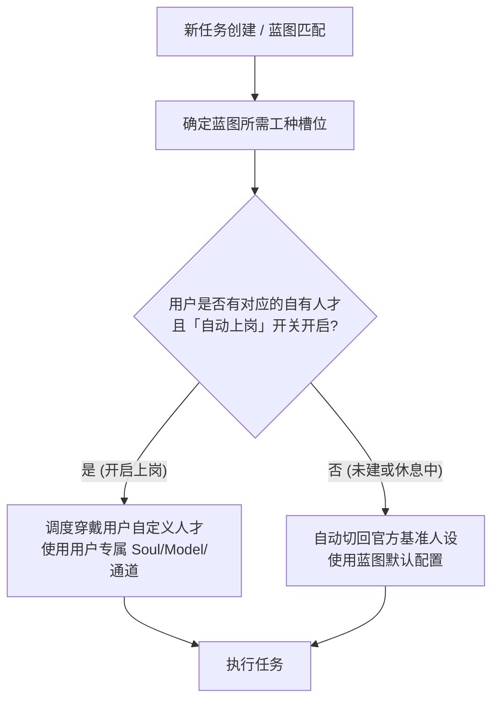

# 人才市场、蓝图展示与连线画布、任务收尾归档增强技术方案设计

> **规范文件路径**：`docs/superpowers/specs/2026-08-17-talent-market-blueprint-canvas-design.md`  
> **状态**：方案草案（已吸收「自动上岗开关 + 正向吸收升级 + 负向隔离保护」机制）  
> **核心原则**：组织形态跟随实际工作，系统人才自进化，用户人才永不变，单开关简明调度，正向吸收升级官方。

---

## 1. 概述与核心诉求

### 1.1 背景与演进脉络
在 Muster 工作台由“固定公司组织”全面转向“**组织形态跟随实际工作**（蓝图打法包 + 动态人设穿戴）”的架构定案下，系统的底层运行已经实现了基于任务标题词元匹配蓝图、按打法包组合班底工具、任务终态自动反思进化战绩的闭环。

然而，在**用户感知层、交互体验与治理控制面**上，目前存在以下四项关键诉求：
1. **人才市场清晰分类与用户自主权**：
   - 界面直观区分「系统预置与沉淀专区」与「我的人才管理区」。
   - **自有人才绝对受控**：系统绝不自动擅改用户自建或复制出来的人才，设置永久保持；用户通过简明的**「自动上岗 / 休息中」开关**控制是否由该人才自动顶替官方人设。
2. **蓝图全貌展示、AI 咨询与隔离调试**：
   - 蓝图作为打法包（人才、工具、阶段工作流、战绩的集合体）提供详尽展示页。
   - 蓝图不可在主界面随意手动乱改，但支持 AI 咨询整理，并在必要时通过**单开独立调试任务（Worktree 隔离）**进行深度修改与版本化回写。
3. **蓝图与系统基准的“正向吸收升级”进化环**：
   - 当用户自建人才上岗并取得优异成效时，系统反思管线自动学习其优势特征，用来**升级优化蓝图中配置的官方默认人设**；若用户人才改坏了/效果差，系统**严格隔离，绝不污染或改差官方基准**。
4. **直观的 React Flow 连线画布**：
   - 借鉴 `Open-DeepSeek-Harness-Desktop` 优秀理念（三栏布局、Sidecar 布局持久化、DAG 防环），复用现有 `@xyflow/react` 实现蓝图工作流与人才能力/资源的可视化连线编排。
5. **任务收尾标准化资产沉淀**：
   - 借鉴 `codex-closeout-archive`，将任务反思与收尾资产沉淀为 1-2 分钟人类可读的高密度总结，强化知识库索引与跨任务高置信检索。

---

## 2. 总体架构与设计原则

```mermaid
graph TB
    subgraph TalentMarket [模块一：人才市场体系]
        SystemTalent[系统预置与沉淀专区<br/>200+ Personas + 自动转正专家<br/>系统自动管理/优化 · 只读展示 · 一键克隆]
        UserTalent[我的人才管理区<br/>用户新建 + 复制副本<br/>通道绑定/模型调整/提示词修改/手动培养<br/>⭐ 纯手动调控 · 系统绝不擅改 · 设置永久保持]
        DutySwitch[「自动上岗 / 休息中」开关<br/>开启: 自动顶替官方人设上岗<br/>关闭: 休息, 自动切回官方基准]
    end

    subgraph BlueprintSystem [模块二：蓝图体系与调试任务]
        BlueprintShowcase[蓝图全貌展示页<br/>班底/工具/阶段工作流/多维战绩/版本快照]
        AIConsult[AI 蓝图咨询整理<br/>对话式打法诊断与重构建议]
        DebugTask[独立蓝图调试任务<br/>单开 Worktree 隔离调试 · 自动测试验证 · 版本化原子回写]
        DefaultPersona[蓝图官方默认人设配置]
    end

    subgraph PositiveEvolution [核心闭环：正向吸收升级 + 负向隔离保护]
        TaskExecution[任务执行 (用户人才上岗)]
        ReflectionCompare{反思比对: 效果是否优于官方基准?}
        AbsorbUpgrade[⭐ 正向吸收: 提取优势特征<br/>自动升级优化蓝图中的官方默认人设]
        NegativeShield[🛡️ 负向保护: 记录归因供用户排查<br/>绝不反向改差官方基准人设]
    end

    subgraph VisualCanvas [模块三：React Flow 连线画布]
        CanvasSidecar[Sidecar 布局存储<br/>坐标/连线独立存储 · 不污染核心模型]
        BlueprintDAG[蓝图阶段工作流画布<br/>阶段节点/条件分流/工具装配/DAG 校验]
        TalentDAG[人才资源能力连线画布<br/>人才中心节点 ↔ 工具/知识库/技能/通道连线]
    end

    subgraph CloseoutArchive [模块四：任务收尾与记忆增强]
        CloseoutPipeline[任务收尾资产管线<br/>5-12转折点 · 关键决策 · 证据路径 · 未决跟进]
        DigestView[1-2分钟人可读摘要卡片<br/>任务页/项目时间线展示]
        ArchiveIndex[跨任务高阶知识库索引<br/>标签精确命中 · 跨项目资产召回]
    end

    SystemTalent -->|一键复制为我的副本| UserTalent
    UserTalent --> DutySwitch
    DutySwitch -->|开启上岗| TaskExecution
    DutySwitch -->|休息关闭| DefaultPersona
    TaskExecution --> ReflectionCompare
    ReflectionCompare -- 效果更优 --> AbsorbUpgrade --> DefaultPersona
    ReflectionCompare -- 效果变差/失败 --> NegativeShield
    BlueprintShowcase --> AIConsult
    AIConsult -->|发起重构| DebugTask
    DebugTask --> BlueprintDAG
    UserTalent --> TalentDAG
    CloseoutPipeline --> DigestView
    CloseoutPipeline --> ArchiveIndex
```

### 2.1 核心设计原则
1. **严格的产权与修改权隔离（Strict Ownership Boundary）**：
   - **系统预置与沉淀专区（`trust: system`）**：由系统全权负责自动升级、自演进与优化。
   - **我的人才（`trust: user`）**：归属用户完全掌控。**系统绝不擅自修改、升级或覆盖用户的任何配置**（Soul/Principles/模型/通道/记忆永久保持），一切改动由用户手动完成。
2. **极简调度控制：单个「自动上岗 / 休息中」开关**：
   - 每个人才配备一个独立开关。
   - **开启（上岗）**：自动匹配该人才负责的蓝图槽位，优先替下官方默认人设。
   - **关闭（休息）**：该人才退出自动调度，蓝图自动且无缝切回官方基准人设。
3. **正向吸收升级 + 负向隔离保护（Positive Distillation & Negative Shield）**：
   - **正向吸收**：当用户的人才在任务中表现出色时，系统自动提炼其成功经验与提示词亮点，用来**升级蓝图中的官方默认人设**，让系统基准持续进化。
   - **负向保护**：如果用户改坏了人才导致任务表现不佳，系统仅记录复盘供用户排查，**绝不把负面结果传导给官方基准**，保证系统官方人设不受劣化污染。
4. **隔离调试与原子回写（Isolated Debugging & Atomic Write-back）**：
   - 蓝图主展示页只读防误改。重构修改单开独立 Worktree 调试任务，验证通过后通过版本快照链原子提交。
5. **视图与核心解耦（Sidecar Layout Persistence）**：
   - 画布排布坐标与连线视图属性保存在 Sidecar 布局表中，不污染业务实体。

---

## 3. 模块一：人才市场与我的人才管理体系

### 3.1 页面架构与双区展示（UI 信息架构）
在前端 `/agents` 页面重构为双区 Tab 结构：

#### 专区 A：系统预置与沉淀专区（System & Crystallized Talents）
- **数据源**：
  1. 系统内置：`personas/` 目录下的 211+ 领域专家人设（研发、写作、数据、架构等）。
  2. 系统沉淀：从真实任务反思中自演进聚类生成的沉淀专家（`expert_candidate` 转正入库）。
- **治理模式**：由系统自动优化、升级。
- **用户交互**：
  - **展示卡片**：头像、名称、所属域、职责简介、官方评级、已掌握技能与推荐工具。
  - **只读详情**：查看标准 Soul、Principles 与工具集。
  - **操作**：
    - `📋 复制为我的人才`：一键克隆为用户自有人才，进入「我的人才」管理区。
    - `💬 专家咨询`：向该官方专家发起咨询。

#### 专区 B：我的人才管理区（My Talents）
- **数据源**：用户自建档案 + 从系统专家复制的自定义副本（`source: 'user'`）。
- **治理模式**：**纯用户手动控制**，系统绝不擅改。
- **核心控制能力**：
  1. **「自动上岗 / 休息中」开关（`is_auto_dispatch`）**：
     - `🟢 自动上岗`：参与任务蓝图自动匹配，顶替官方默认人设。
     - `⏸️ 休息中`：不参与自动匹配，系统自动切回官方基准人设。
  2. **提示词完全定制（Soul & Principles）**：
     - 用户手动编辑设定、口吻与强约束工作原则，设置永久保持。
  3. **模型与通道专属绑定（Executor & Model Overrides）**：
     - 绑定专属执行器通道（Claude Code CLI / Codex / API / Antigravity）。
     - 绑定专属模型（如 `claude-3-7-sonnet` / `deepseek-r1`）与思考深度（off/low/med/high）。
  4. **活动状态看板（Activity & Placement）**：
     - 查看当前状态：`空闲 (idle)` / `正在执行任务 (busy, 附任务链接)`。
     - 查看其所承接的蓝图槽位与历史执行记录。
  5. **全景记忆与知识库（Memory & Knowledge）**：
     - 查看四层记忆（Personal / Skill / Workspace / Project）与关联归档。
  6. **手动培养与训导（Manual Nurturing）**：
     - 用户可发起模拟对话，手动添加工作原则或微调记忆条目。

### 3.2 简明调度路由逻辑



---

## 4. 模块二：蓝图展示、AI 咨询与正向吸收进化

### 4.1 蓝图展示页（Blueprint Showcase & Details）
在 `/blueprints/:id` 路由展示蓝图全貌：
- **核心打法**：任务类型标签（`label`）、业务分类（`taskType`）、用户语言描述（`description`）。
- **班底阵容（Staffing）**：展示每个槽位的**官方默认配置人设**，以及当前是否有用户的自有人才处于「自动上岗」承接状态。
- **常用工具集（Tools）**：列出打法高频使用的工具/技能/MCP 及其有效性。
- **阶段工作流（Stages）**：结构化阶段流（步骤、目标、准出条件）。
- **多维战绩（Performance Metrics）**：官方基准战绩、胜率、返工率与综合评分。
- **版本快照链（Version Timeline）**：历次结构性变更快照与一键回滚。
- **只读保护**：详情页默认只读，禁止散碎手工修改字段。

### 4.2 蓝图 AI 咨询整理功能（AI Blueprint Consultant）
- 蓝图详情页右上角提供「💡 蓝图咨询与诊断」。
- 用户可对话式咨询打法瓶颈、阶段合理性与工具配置，AI 可生成重构建议报告，并支持「🚀 单开调试任务执行此重构」。

### 4.3 核心闭环：正向吸收升级 + 负向隔离保护机制
当用户人才处于「自动上岗」状态完成任务时，反思管线触发双向处理：

1. **正向吸收升级（用户人才表现优异）**：
   - **触发条件**：任务成功（Win）、0 返工（Rework=0）、综合指标优于当前官方基准。
   - **系统行为**：
     - 反思引擎分析用户人才的执行轨迹：识别是哪条提示词原则、哪种思考深度、或者哪个工具调用链带来了优势；
     - 系统自动将这些亮点蒸馏提炼，**自动升级该蓝图中配置的「官方默认人设」与「打法工具集」**；
     - 蓝图版本库生成一笔新的提交记录：`"吸收用户自有人才实践优化官方基准配置 (evidence: task-xxx)"`。
2. **负向隔离保护（用户人才改坏了/效果差）**：
   - **触发条件**：任务失败（Fail）、发生返工（Rework > 0）或人工纠正。
   - **系统行为**：
     - 反思引擎进行归因分析，将冲突或问题原因记录在当前任务的复盘日志中（供用户自行查看与调优）；
     - **严格隔离**：绝不将负面表现传导给蓝图官方默认人设，**官方基准配置保持原样，绝不反向改差**。

### 4.4 独立蓝图调试任务（Blueprint Debugger Task）
- 用户若需对蓝图进行深度架构调整，单开独立 Task。
- 在独立 Worktree 中由 Agent 推演、重构阶段与参数，完成 DAG 验证后，通过 `blueprint_version` **原子回写并发布**至主库，主工程运行不受干扰。

---

## 5. 模块三：React Flow 驱动的连线画布系统

### 5.1 参考借鉴与架构选型
- **借鉴 `Open-DeepSeek-Harness-Desktop`**：
  1. **三栏经典布局**：左侧节点能力库 / 中间交互画布 / 右侧属性面板。
  2. **Sidecar 布局持久化**：视觉坐标 `(x, y)` 独立存入 `canvas_layout` 表，与业务实体分离。
  3. **DAG 防环拓扑校验**：连线时实时检测，阻断自环与回路。
- **技术栈**：复用项目已有的 `@xyflow/react` (React Flow 12)。

### 5.2 蓝图工作流连线画布（Blueprint Stage Canvas）
- **节点类型**：
  - `stageNode`：工作阶段（步骤名称、执行人设槽位、依赖工具、准出标准）。
  - `decisionNode`：决策分流节点（条件判断、自动验收分支、人工审批）。
  - `deliverableNode`：关键交付物节点。
- **边（Edge）与分流分支**：`always` 顺序流、`auto_review`（PASS 走主线，FAIL/CHANGES 走返工线）、`manual_approval` 审批流。

### 5.3 人才能力与资源连线画布（Talent Capability Canvas）
在自有人才详情中提供直观连线图：
- **中心节点**：人才本体（Talent Center Node）。
- **四周连线挂载节点**：
  - `Tool / MCP Node`：拖拽连线赋予工具权限。
  - `Knowledge / Archive Node`：拖拽连线绑定归档检索范围。
  - `Skill Node`：拖拽连线绑定专长技能包。
  - `Channel / Model Node`：拖拽连线绑定执行器通道与模型。
- **免除繁琐手写配置**，直观一眼看清人才全貌。

---

## 6. 模块四：任务收尾归档与记忆整理增强

### 6.1 标准化收尾资产模板（Closeout Summary Asset Template）
借鉴 `codex-closeout-archive`，任务结束时反思管线生成 8 节高密度结构化收尾资产：
1. **目标与交付物全景**：原始目标与产物绝对路径链接。
2. **5-12 个关键转折时间线（Timeline Turns）**：关键转折与推进节点。
3. **关键决策与修正记录（Decisions & Corrections）**：架构决策与中途纠偏。
4. **证据链与验证结果（Evidence & Verification）**：测试通过数、Commit SHA。
5. **未决事项与后续跟进（Follow-ups）**：下一步行动清单。
6. **提炼沉淀的工作原则（Craft & Principles）**：新增方法论。
7. **检索标签（Search Tokens）**：高阶标签。

### 6.2 消费与回写链路
- **Task 详情页**：新增 1-2 分钟速读卡片。
- **归档本体沉淀**：写入 `archive` 表，供 `archive.ts` 跨任务、跨项目高置信检索。

---

## 7. 数据库 Schema 迁移设计

新增迁移文件：`src/server/db/migrations/0022_talent_market_blueprint_canvas.sql`

```sql
-- 1. 我的人才管理与自动上岗开关
ALTER TABLE agent_profile ADD COLUMN source TEXT NOT NULL DEFAULT 'user';       -- 'user' | 'system' | 'crystallized'
ALTER TABLE agent_profile ADD COLUMN source_persona_id TEXT;                   -- 绑定的对应系统 Persona ID
ALTER TABLE agent_profile ADD COLUMN is_auto_dispatch INTEGER NOT NULL DEFAULT 1; -- 1: 自动上岗; 0: 休息中
ALTER TABLE agent_profile ADD COLUMN custom_executor_json TEXT;                -- 专属执行器通道配置
ALTER TABLE agent_profile ADD COLUMN custom_model TEXT;                        -- 专属模型覆盖
ALTER TABLE agent_profile ADD COLUMN custom_thinking_depth TEXT;               -- 思考深度覆盖 (off|low|med|high)

-- 2. 画布 Sidecar 布局持久化表 (解耦视觉排布与核心逻辑)
CREATE TABLE IF NOT EXISTS canvas_layout (
  id TEXT PRIMARY KEY,
  target_kind TEXT NOT NULL,                                                   -- 'blueprint' | 'talent' | 'workflow'
  target_id TEXT NOT NULL,                                                     -- blueprint_id 或 profile_id
  layout_data_json TEXT NOT NULL,                                              -- 节点坐标 (x, y), handles, 缩放
  created_at TEXT NOT NULL,
  updated_at TEXT NOT NULL,
  UNIQUE(target_kind, target_id)
);

-- 3. 任务收尾标准化资产表
CREATE TABLE IF NOT EXISTS task_closeout_summary (
  id TEXT PRIMARY KEY,
  task_id TEXT NOT NULL UNIQUE REFERENCES task(id) ON DELETE CASCADE,
  project_id TEXT NOT NULL REFERENCES project(id) ON DELETE CASCADE,
  company_id TEXT NOT NULL REFERENCES company(id) ON DELETE CASCADE,
  persona_id TEXT,
  summary_title TEXT NOT NULL,
  timeline_turns_json TEXT NOT NULL,                                           -- 5-12 个关键时间线转折
  decisions_json TEXT NOT NULL,                                                -- 关键决策与修正
  deliverables_json TEXT NOT NULL,                                             -- 产物与证据路径
  follow_ups_json TEXT NOT NULL,                                               -- 未决跟进事项
  craft_principles_json TEXT NOT NULL,                                         -- 提炼出的原则
  search_tokens_json TEXT NOT NULL,                                            -- 检索标签
  markdown_content TEXT NOT NULL,                                              -- 完整渲染 Markdown
  created_at TEXT NOT NULL
);

CREATE INDEX IF NOT EXISTS idx_closeout_project ON task_closeout_summary(project_id);
CREATE INDEX IF NOT EXISTS idx_closeout_company ON task_closeout_summary(company_id);
```

---

## 8. 实施里程碑（由简入繁路线图）

| 里程碑阶段 | 重点交付目标 | 核心工作内容 | 预期复杂度 |
| :--- | :--- | :--- | :--- |
| **阶段一**<br/>*(基础展示与人才分流)* | 人才市场双区展示<br/>+ 「自动上岗」开关<br/>+ 自有人才深度配置 | 1. 改造 `AgentLibraryPage` 为系统区 vs 我的人才区；<br/>2. 实现一键克隆与「自动上岗/休息」开关；<br/>3. 扩展自有人才提示词/模型通道配置（系统不改动，永久保持）；<br/>4. 调度引擎按开关进行自有人才/官方基准路由。 | 🟢 低风险 / 轻量闭环 |
| **阶段二**<br/>*(蓝图展示与正向进化)* | 蓝图全貌展示页<br/>+ AI 咨询诊断<br/>+ 正向吸收升级机制<br/>+ 隔离调试任务 | 1. 实现 `/blueprints/:id` 蓝图全貌展示页与只读保护；<br/>2. 接入 AI 蓝图咨询与诊断接口；<br/>3. 实现反思管线的「正向吸收升级官方人设 + 负向隔离保护」；<br/>4. 落地独立 Worktree 蓝图调试任务机制与版本原子回写。 | 🟡 中等复杂度 / 流程闭环 |
| **阶段三**<br/>*(连线画布与收尾归档)* | React Flow 连线画布<br/>+ 标准化任务收尾资产<br/>+ 知识库高阶索引 | 1. 基于 `@xyflow/react` 构建蓝图 DAG 工作流画布（Sidecar 布局 + 防环）；<br/>2. 实现自有人才能力/资源连线挂载画布；<br/>3. 反思管线接入 8 节收尾资产生成、1-2 分钟速读卡片与跨任务高置信检索。 | 🔴 高交互 / 高价值资产 |

---

## 9. 验收标准与验证方案

1. **单元与逻辑测试**：
   - 「自动上岗」开关开启时优先调度自有人才；关闭（休息）时无缝切回官方基准人设；
   - 用户自有人才配置不可变断言：反思与优化器绝不向 `source: 'user'` 写入任何修改；
   - 正向吸收断言：自有人才高分任务触发官方默认配置升级；低分/返工任务触发负向隔离，官方配置零变更；
   - 连线画布 DAG 检测算法阻断自环与回路。
2. **集成与端到端测试**：
   - 人才克隆 -> 开关切换 -> 发起任务验证调度路由；
   - 蓝图展示 -> 发起调试任务 -> 版本提交回写；
   - 任务完成产出 8 节收尾摘要并在任务页渲染速读卡片。

---

## 10. 第三方与开源技术借鉴登记

根据项目规则，已在 `THIRD_PARTY_NOTICES.md` 登记：
- **`ahamoment-101/Open-DeepSeek-Harness-Desktop`**：借鉴画布三栏布局结构、Sidecar 视觉布局解耦设计与权限划分理念（技术基于已有 `@xyflow/react`）。
- **`ChenJinCloud/codex-closeout-archive`**：借鉴 8 节任务收尾资产模板规范、5-12 转折时间线标准与 1-2 分钟速读资产设计。
